<a name="readme-top"></a>

<div align="center">
  
  </br></br>

  [](https://github.com/ScienceOne-AI/DeepLiterature/stargazers)
[](https://opensource.org/licenses/Apache-2.0)
[](https://github.com/ScienceOne-AI/DeepLiterature/issues)
[](https://github.com/ScienceOne-AI/DeepLiterature/issues)
  <br>


  English | [简体中文](README_zh-CN.md)


</div>


<span id='repo-introduction'/>

# 📖 Introduction

DeepLiterature is an open-source science deep research framework, jointly launched by the Institute of Automation, Chinese Academy of Sciences; the National Science Library, Chinese Academy of Sciences; the Computer Network Information Center, Chinese Academy of Sciences; Beijing Wenge Technology Co., Ltd.; and Zidong Taichu (Beijing) Technology Co., Ltd. It aims to provide various tool support for intelligent agent systems. Currently, DeepLiterature supports four types of tools: Search Engine, Code Runner, Link Parser, and Information expander.


<span id='news'/>

## 🔥 News
  - **[2025/03]** DeepLiterature officially released, supporting tools such as Search Engine, Code Runner, Link Parser, and Information expander.


<span id='table-of-contents'/>

## 📑 Table of Contents 

* <a href='#repo-introduction'>📖 Introduction</a>
* <a href='#news'>🔥 News</a>
* <a href='#table-of-contents'>📑 Table of Contents</a>
* <a href='#agent-framework'>🤖 Agent Framework</a>
  * <a href='#flowchart'>Flowchart</a>
  * <a href='#module-description'>Module Description</a>
  * <a href='#tools-info'>Tool Library</a>
* <a href='#evaluation'>🏆 Evaluation</a>
* <a href='#case-study'>🎬 Case Study</a>
* <a href='#quickstart'>⚡ Quickstart</a>
  * <a href='#code-base'>🗂️ Code Structure</a>
  * <a href='#select-api'>⚙️ Configure API</a>
  * <a href='#select-prompt'>📝 Select Prompt Template</a>
  * <a href='#select-search-engine'>🔍 Configure Search Engine</a>
  * <a href='#select-url-parser'>🖥️ Configure URL Parser</a>
  * <a href='#select-llm'>✈️ Configure LLM</a>
  * <a href='#select-code-runner'>💻 Configure Code Runner</a>
  * <a href='#lanuch'>🚀 Launch Platform</a>
  * <a href='#begin-chat'>💬 Start Chat</a>
* <a href='#todo-list'>📝 TODO</a>
* <a href='#acknowledgement'>🙏 Acknowledgement</a>
* <a href='#license'>📄 License</a>


<span id='agent-framework'/>

## 🤖 Agent Framework 

The core of DeepLiterature lies in building a multi-agent interactive collaboration framework, which integrates various tools and achieves flexible expansion and efficient collaboration through modular design.

<span id='flowchart'/>

### 📊 Flowchart 

Below is a schematic diagram of the main internal processes of the system, showing the information transfer and call flow between modules:

```mermaid
flowchart TD
    A[Task📃] --> B[🤖 Planner]
    B --> C[🧠 Optimizer]
    C --> B
    B --> D[🔍 Searcher]
    D --> G[🧠 Discriminator]
    G --> H[URL Parser 🔗]
    H --> B
    B --> E[🤖 Code Generator]
    E --> F[🖥️ Code Runner]
    F --> B
    G --> B
    F --> I[✒️ Writer]
    B --> I
    D --> I
    H --> I
    I --> J[📰 Publisher]
```





<span id='module-description'/>

### Module Description

- **Planner**: Responsible for receiving user input, parsing requests, and coordinating module calls.
- **Optimizer**: Uses external search interfaces to retrieve and return relevant information summaries.
- **Code Generator**: Generates code based on the code description distributed by the planner, supporting multi-language environments.
- **Code Runner**: Executes the code generated by the code generator in a secure sandbox, supporting multi-language environments.
- **Searcher**: Uses search engines to retrieve relevant web content.
- **Discriminator**: Analyzes search result summaries and determines whether to obtain the full text to improve answer accuracy.
- **URL Parser**: Parses link content and retrieves the full text of web pages.
- **Writer**: Writes output raw data based on user instructions and obtained materials.
- **Publisher**: Processes the raw data from the writer to form output that meets user instructions.

<span id='tools-info'/>

### 🛠️ Tool Library 

This framework integrates the following tool libraries to achieve the above agents:
- **🔍 Search Engine**: Efficiently retrieves network information.
- **🖥️ Code Runner**: Supports online code running and debugging.
- **🔗 Link Parser**: Parses, verifies, and extracts data from links.
- **🧠 Information Expansion**: Based on search results, determines whether the summary information is relevant; when the summary information is insufficient to answer the question, automatically obtains the full text.


<span id='evaluation'/>

## 🏆 Evaluation 

We tested on the [smolagents-benchmark](https://huggingface.co/datasets/smolagents/benchmark-v1/), which aggregates subsets from multiple datasets: [GAIA](https://huggingface.co/datasets/gaia-benchmark/GAIA) (32 items), [MATH](https://github.com/hendrycks/math) (50 items), [SimpleQA](https://huggingface.co/datasets/basicv8vc/SimpleQA) (50 items). Below are the results of our DeepLiterature and [smolagent(HF)](https://github.com/huggingface/smolagents).


<div align="center">
    
</div>


<span id='case-study'/>

## 🎬 Case Study

The following examples demonstrate the application effect of DeepLiterature in actual conversations, providing both Chinese and English versions (the following GIF files are for illustration only, please replace them with corresponding examples in actual use).

### Chinese Example

> Query 1 (GPT-4o)：分析2024年中国的电商公司，截至到Q3季度的盈利情况，可以按照季度对比，可以横向对比不同的公司。分析各个公司的市场份额情况。

  <div align="center">
    
  </div>


> Query 2 (GPT-4o)：帮我找到2024年中国生产总值top10的城市，以柱状图呈现top10的城市及生产总值。对比这些城市在过去三年的人口变化情况，以折线图的方式展示人口变化。

  <div align="center">
    
  </div>

### English Example

> Query 1 (DeepSeek-R1)：Statistics on the number of Nobel Prize winners by country in recent years, and analyze the age groups of Nobel Prize recipients.
  
  <div align="center">
    
  </div>

> Query 2 (DeepSeek-R1)：Identify the top 3 most profitable cloud providers globally. Use a bar chart to illustrate the profitability of these three companies. Locate the top 1 cloud provider and analyze its profit changes over the past three years.
  
  <div align="center">
    
  </div>


<span id='quickstart'/>

## ⚡ Quickstart 

<!-- [⚡Online Experience](https://xxxxxxxx)  -->

The following content will help you quickly deploy and experience DeepLiterature.

<span id='code-base'/>

### 🗂️ Code Structure 

DeepLiterature adopts a modular design, with the main directory structure as follows:

 ```bash
  ./src/
  ├── agents  # Agent modules, defining different role agents and corresponding prompt templates
  ├── config # Configuration files, configurable for search engine API, web parsing, and code execution modules
  ├── llms # LLM invocation modules
  ├── logo # Front-end display library
  ├── service # Platform and REST-ful API services
  ├── tools # Executor module, which implements code runner and search engine
  ├── utils # General utility library
  └── workflow # Task workflow modules
  ```

<span id='select-api'/>

### ⚙️ Configure API 

- Configuration files are located in the `src/configs/` directory, you can modify the default parameters as needed.
- Each module provides a unified interface for configuration, see the documentation for each module.

<span id='seelct-prompt-templaste'/>

### 📝 Select Prompt Template

- Default prompt templates are provided in both Chinese and English.
- Template files are stored in `src/agents/prompts/`, users can customize them according to actual applications. The prompt file names correspond to the agent file names: for example, `src/agents/orchestrator_agent.py` corresponds to `src/agents/prompts/orchestrator_agent_prompts.py`.
- Switch between Chinese and English prompt templates: through the `language` configuration in `configs/config.yml`.
  
  ```yml
  deepliterature:
    language: <LANG> # ["zh", "en"]
  ```

<span id='select-search-engine'/>

### 🔍 Configure Search Engine 

- Modify `src/configs/config.yml` to configure the search API key, request parameters, etc.
- Supports parallel calls to multiple search engines to improve retrieval efficiency and accuracy, with [SerpAPI](https://serpapi.com) used by default.
  ```yml
  search-engine:
      search_engine: "serp"
      serp:
        api_url: "https://serpapi.com/search"
        api_key: <YOUR_API_KEY>
        gl: <GOOGLE_LOCATION> # such as "cn"
        hl: <GOOGLE_LANGUAGE> # such as "zh-cn"
  ```

- [SerpAPI](https://serpapi.com) is an API service that provides search engine results, allowing developers to integrate search engine functionalities like Google and Bing into their applications. It supports various parameter settings and can perform customized searches based on region and language. With SerpAPI, users can easily obtain Google search results without directly interacting with Google Search or dealing with complex crawlers and CAPTCHA issues. Specifically:

  - gl: This parameter defines the country for using Google Search. It is a two-letter country code (e.g., us for the United States, uk for the United Kingdom, fr for France). See [Google country page](https://serpapi.com/google-countries) for more details.
  - hl: This parameter defines the language for using Google Search. It is a two-letter language code (e.g., en for English, es for Spanish, fr for French). See [Google language page](https://serpapi.com/google-languages) for more details.

<span id='select-url-parser'/>

### 🖥️ Configure URL Parser

- Modify `src/configs/config.yml` to configure the API key, request parameters, etc. [Jina API](https://jina.ai) is used by default.
  ```yml
  jina:
    api_url: "https://r.jina.ai/"
    api_key: <YOUR_API_KEY>
  ```
- [JinaAI](https://jina.ai) is dedicated to building search systems for any type of data, including text, images, audio, and video. Through modular design and multiple layers of abstraction, users can effectively build systems by parts or link them into a stream for an end-to-end experience.

<span id='select-llm'/>

### ✈️ Configure LLM 
- Modify `src/configs/config.yml` to configure the remote LLM API key, request parameters, etc., and switch the LLM through the `llm_model` option.
  ```yml
  llm:
    max_context_length: <MAX_CONTEXT_LENGTH>
    llm_model: <LLM_MODEL_TYPE> # ["remote-llm", "remote-reasoning-llm"]
    remote-llm:
      api_url: <YOUR_API_URL>
      api_key: <YOUR_API_KEY>
      model_name: <YOUR_MODEL_NAME>
      tokenizer:
        tokenizer_class: <TOKENIZER_CLASS>
        tokenizer_name_or_path: <TOKENIZER_NAME_OR_PATH>
    remote-reasoning-llm:
      api_url: <YOUR_API_URL>
      api_key: <YOUR_API_KEY>
      model_name: <YOUR_MODEL_NAME>
      tokenizer:
        tokenizer_class: <TOKENIZER_CLASS>
        tokenizer_name_or_path: <TOKENIZER_NAME_OR_PATH>
  ```


<span id='select-code-runner'/>

### 💻 Configure Code Runner

- In `src/configs/config.yml`, modify `api_url` to your custom code runner API.
  
  ```yml
    code-runner:
      api_url: <YOUR_CODE_RUNNER_API>
  ```
  The code runner API is called via **POST** request and must conform to the following request and response formats.
  - Request format: The request body is in JSON format and includes the following fields.
    ```yml
      {
        "id": <REQUEST_ID>, # Unique identifier for the request, type: string
        "code_text": <CODE>, # Code text, type: string
        "code_type": <PROGRAMMING_LANGUAGE>, # Programming language type, e.g., "python"
      }
    ```
  - Response format: The response body is in JSON format, with the code execution text output in the `text` field and image output in the `img` field. Example response:
    ```yml
      {
        "id": <REQUEST_ID>, # Unique identifier for the request, type: string
        "code": 200, # Status code: 200 for success, 500 for failure, type: int
        "data": [
          {"text": "Hello world!\n"}, 
          {"img": "iVBORw0KGgoAAAANSUhEUgAAAjMAAAHFCAYAAAAHcXhbAAAAOXRFWHRTb2Z0d2FyZQBNYXRwbG90bGliIHZlcnNpb24zLjYuMiwgaHR0cHM6Ly9tYXRwbG90bGliLm9yZy8o6BhiAAAACXBIWXMAAA9hAAAPY……ggg=="}, 
          {"text": "Hello DeepLiterature"}
        ], 
        "msg": "success", # Execution status message, type: string
        "time": 0.711 # Execution time in seconds, type: float
      }
    ```
- Ensure security: The code runner uses a sandbox mechanism to ensure user code runs in an isolated environment.

<span id='lanuch'/>

### 🚀 Launch Platform 


- After cloning the repository, install dependencies:

  ```bash
  git clone https://github.com/ScienceOne-AI/DeepLiterature.git
  cd DeepLiterature
  pip install -r requirements.txt
  ```

- Start the platform service:
  ```bash
  streamlit run server.py --server.port=36667
  ```

- Start the API service:
  ```bash
  # Default port 36668
  python api.py
  ```

  ```
  # Test sample
  curl --location 'http://127.0.0.1:36668/stream' \
  --header 'Content-Type: application/json' \
  --data '{
      "query": "Which country ranked first in the medal tally of the 2025 Winter Asian Games, and display the number of each medal in a bar chart."
  }'
  ```
  ```
  # Output format:
  data: {
    "id": "978210f0-23fd-4f43-9d82-4837e4cb8e28",
    "created": 1741312834,
    "choices": [
        {
            "index": 0,
            "delta": {
                "reasoning_content": "",
                "content": ""
            }
        }
    ],
    "stage": ""
  }
  ```

<span id='begin-chat'/>

### 💬 Start Chat 

- Access the local service (such as [http://localhost:36667](http://localhost:36667)), enter the chat page, and experience the intelligent Q&A service provided by DeepLiterature.

<span id='todo-list'/>

## 📝 TODO 

- [ ] Launch the DeepLiterature experience platform.
- [ ] Provide a search engine focused on scientific literature.
- [ ] Provide a general code executor interface.
- [ ] Complete HLE benchmark testing and display detailed test results.
- [ ] Support more customization options for each module, allowing users to configure flexibly according to their needs.

<span id='acknowledgement'/>

## 🙏 Acknowledgement 
The front-end display part of this framework is implemented through the [Streamlit](https://streamlit.io/cloud) lightweight application platform, thanks to their contribution.

<span id='license'/>

## 📄 License 

DeepLiterature is open-sourced under the [Apache 2.0 License](./LICENSE), welcome to use and contribute code under the license agreement.
