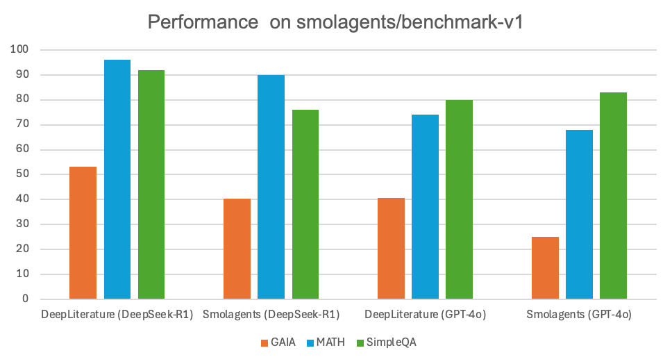

<a name="readme-top"></a>

<div align="center">
  
  </br></br>

  [](https://github.com/ScienceOne-AI/DeepLiterature/stargazers)
[](https://opensource.org/licenses/Apache-2.0)
[](https://github.com/ScienceOne-AI/DeepLiterature/issues)
[](https://github.com/ScienceOne-AI/DeepLiterature/issues)
  <br>

  [English](README.md) | 简体中文
  
</div>


<span id='repo-introduction'/>

# 📖 简介

DeepLiterature 是一个开源的科学 Deep Research 框架，由中国科学院自动化研究所、中国科学院文献情报中心、中国科学院计算机网络信息中心、中科闻歌、紫东太初联合推出，旨在为智能代理系统提供多种工具支持。当前 DeepLiterature 支持四类工具：搜索引擎、代码执行器、链接解析、信息拓展。


<span id='news'/>

## 🔥 更新
  - **[2025/03]** DeepLiterature 正式发布，支持搜索引擎、代码执行器、链接解析、信息拓展等工具


<span id='table-of-contents'/>

## 📑 目录 

* <a href='#repo-introduction'>📖 简介</a>
* <a href='#news'>🔥 更新</a>
* <a href='#table-of-contents'>📑 目录</a>
* <a href='#agent-framework'>🤖 Agent 框架</a>
  * <a href='#flowchart'>流程图</a>
  * <a href='#module-description'>各模块简介</a>
  * <a href='#tools-info'>工具库</a>
* <a href='#evaluation'>🏆 榜单评价</a>
* <a href='#case-study'>🎬 示例</a>
* <a href='#quickstart'>⚡ 快速上手</a>
  * <a href='#code-base'>🗂️ 代码架构</a>
  * <a href='#select-api'>⚙️ 配置接口</a>
  * <a href='#select-prompt'>📝 选择 Prompt 模板</a>
  * <a href='#select-search-engine'>🔍 配置搜索引擎</a>
  * <a href='#select-url-parser'>🖥️ 配置网页解析引擎</a>
  * <a href='#select-llm'>✈️ 配置大模型</a>
  * <a href='#select-code-runner'>💻 配置代码执行器</a>
  * <a href='#lanuch'>🚀 平台启动</a>
  * <a href='#begin-chat'>💬 开始对话</a>
* <a href='#todo-list'>📝 TODO</a>
* <a href='#acknowledgement'>🙏 致谢</a>
* <a href='#license'>📄 证书</a>


<span id='agent-framework'/>

## 🤖 智能体框架 

DeepLiterature 的核心在于搭建了一套多智能体的交互协作框架，该框架整合了多种工具，通过模块化设计实现灵活扩展与高效协同工作。

<span id='flowchart'/>

### 📊 流程图 

下面是系统内部的主要流程图示意，展示了各模块之间的信息传递与调用流程：


<span id='module-description'/>

### 各模块简介

- **规划器-Planner**：负责接收用户输入、解析请求并协调各模块调用。
- **优化器-Optimizer**：利用外部搜索接口检索并返回相关信息摘要。
- **代码生成器-CodeGenerator**：根据规划器分发的代码描述，生成代码，支持多语言环境。
- **代码执行器-CodeRunner**：安全沙箱内执行代码生成器的代码，支持多语言环境。
- **搜索器-Researcher**：利用搜索引擎，检索相关网页内容。
- **判别器-Discriminator**：分析搜索结果摘要，判断是否需要获取全文以提升解答准确率。
- **链接解析器-URLParser**：解析链接内容，获取网页全文内容。
- **撰写者-Writer**：根据用户指令和获取的资料，撰写输出原始数据。
- **发布者-Plblisher**：对撰写者的原始数据加工，形成符合用户指令的输出。

<span id='tools-info'/>

### 🛠️ 工具库介绍 

本框架集成了以下工具库，以实现上述智能体：
- **🔍 搜索引擎**：高效检索网络信息。
- **🖥️ 代码执行器**：支持代码在线运行与调试。
- **🔗 链接解析**：对链接进行解析、校验及数据抽取。
- **🧠 信息拓展**：基于搜索结果，判断摘要信息是否相关；当摘要信息不足以解答问题时，自动获取全文信息。


<span id='evaluation'/>

## 🏆 榜单评价 

我们在 [smolagents-benchmark](https://huggingface.co/datasets/smolagents/benchmark-v1/) 上进行了测试，该榜单由多个数据集的子集聚合而成：[GAIA](https://huggingface.co/datasets/gaia-benchmark/GAIA)（32条）、[MATH](https://github.com/hendrycks/math)（50条）、[SimpleQA](https://huggingface.co/datasets/basicv8vc/SimpleQA)（50条），以下是我们 DeepLiterature 和 [smolagent(HF)](https://github.com/huggingface/smolagents) 的结果。


<div align="center">
    
</div>


<span id='case-study'/>

## 🎬 示例 

以下示例展示了 DeepLiterature 在实际对话中的应用效果，均提供中文和英文版本（以下 GIF 文件仅为示意，实际使用时请替换为对应示例）。

### 中文示例

> 问题1 (GPT-4o)：分析2024年中国的电商公司，截至到Q3季度的盈利情况，可以按照季度对比，可以横向对比不同的公司。分析各个公司的市场份额情况。

  <div align="center">
    
  </div>


> 问题2 (GPT-4o)：帮我找到2024年中国生产总值top10的城市，以柱状图呈现top10的城市及生产总值。对比这些城市在过去三年的人口变化情况，以折线图的方式展示人口变化。

  <div align="center">
    
  </div>

### 英文示例

> 问题1 (DeepSeek-R1)：Statistics on the number of Nobel Prize winners by country in recent years, and analyze the age groups of Nobel Prize recipients.
  
  <div align="center">
    
  </div>

> 问题2 (DeepSeek-R1)：Identify the top 3 most profitable cloud providers globally. Use a bar chart to illustrate the profitability of these three companies. Locate the top 1 cloud provider and analyze its profit changes over the past three years.
  
  <div align="center">
    
  </div>


<span id='quickstart'/>

## ⚡ 快速上手 

<!-- [⚡在线体验](https://xxxxxxxx)  -->

以下内容将帮助你快速部署与体验 DeepLiterature。

<span id='code-base'/>

### 🗂️ 代码架构 

DeepLiterature 采用模块化设计，主要目录结构如下：


  ```bash
  ./src/
  ├── agents  # 智能体模块，定义不同角色智能体及对应提示词模板
  ├── config # 配置文件，可配置搜索引擎API、网页解析、代码执行模块
  ├── llms # LLM调用模块
  ├── logo # 前端展示库
  ├── service # 平台和REST-ful api服务
  ├── tools # 执行器模块，实现代码执行与搜索引擎搜索能力
  ├── utils # 通用工具库
  └── workflow # 任务工作流模块
  ```

<span id='select-api'/>

### ⚙️ 配置接口 

- 配置文件位于 `src/configs/` 目录下，你可以根据需求修改默认参数。
- 各模块均提供统一接口进行配置，详见各模块文档。

<span id='seelct-prompt-templaste'/>

### 📝 选择 Prompt 模板

- 默认提供中英文两种语言的 prompt 模板。
- 模板文件存放在 `src/agents/prompts/` 下，用户可根据实际应用进行定制化修改。Prompt 文件名与 agent 文件名对应：例如：`src/agents/orchestrator_agent.py` 与 `src/agents/prompts/orchestrator_agent_prompts.py` 对应。
- 切换中英 prompt 模版：通过 `configs/config.yml` 的 `language` 配置

  ```yml
  deepliterature:
    language: <LANG> # ["zh", "en"]
  ```

<span id='select-search-engine'/>

### 🔍 配置搜索引擎 

- 修改 `src/configs/config.yml`，配置你所使用的搜索 API 密钥、请求参数等信息。
- 支持多个搜索引擎的并行调用，提升检索效率与准确性，默认使用 [SerpAPI](https://serpapi.com)。
  ```yml
  search-engine:
      search_engine: "serp"
      serp:
        api_url: "https://serpapi.com/search"
        api_key: <YOUR_API_KEY>
        gl: <GOOGLE_LOCATION> # such as "cn"
        hl: <GOOGLE_LANGUAGE> # such as "zh-cn"
  ```
- [SerpAPI](https://serpapi.com) 是一项提供搜索引擎结果的 API 服务，允许开发者在应用程序中集成如 Google、Bing 等搜索引擎的功能。它支持多种参数设置，可以根据地域和语言进行定制化搜索。通过SerpApi，用户可以轻松获取 Google 搜索结果，而无需直接与 Google 搜索进行交互，也不需要处理复杂的爬虫和验证码，其中：

    - gl: 该参数定义使用 Google 搜索的国家。它是一个两位字母的国家代码。（例如，us 代表美国，uk 代表英国，fr 代表法国），详见 [Google country page](https://serpapi.com/google-countries)。
    - hl: 该参数定义使用 Google 搜索的语言。它是一个两位字母的语言代码。（例如，en 代表英语，es 代表西班牙语，fr 代表法语），详见 [Google language page](https://serpapi.com/google-languages)。

<span id='select-url-parser'/>

### 🖥️ 配置网页解析引擎

- 修改 `src/configs/config.yml`，配置你所使用的网页解析引擎 API 密钥、请求参数等信息，默认使用 [Jina API](https://jina.ai)。
  ```yml
  jina:
    api_url: "https://r.jina.ai/"
    api_key: <YOUR_API_KEY>
  ```
- [JinaAI](https://jina.ai) 致力于为任何类型的数据建立搜索系统，包括文本、图像、音频、视频等。通过模块化设计和多层抽象，用户可以利用有效的模式按部分构建系统，或者将它们链接到流中以获得端到端的体验。

<span id='select-llm'/>

### ✈️ 配置大模型 
- 修改 `src/configs/config.yml`，配置你所使用的远程大模型 API 密钥、请求参数等信息，并通过配置 `llm_model` 选项切换大模型。
  ```yml
  llm:
    max_context_length: <MAX_CONTEXT_LENGTH>
    llm_model: <LLM_MODEL_TYPE> # ["remote-llm", "remote-reasoning-llm"]
    remote-llm:
      api_url: <YOUR_API_URL>
      api_key: <YOUR_API_KEY>
      model_name: <YOUR_MODEL_NAME>
      tokenizer:
        tokenizer_class: <TOKENIZER_CLASS>
        tokenizer_name_or_path: <TOKENIZER_NAME_OR_PATH>
    remote-reasoning-llm:
      api_url: <YOUR_API_URL>
      api_key: <YOUR_API_KEY>
      model_name: <YOUR_MODEL_NAME>
      tokenizer:
        tokenizer_class: <TOKENIZER_CLASS>
        tokenizer_name_or_path: <TOKENIZER_NAME_OR_PATH>
  ```


<span id='select-code-runner'/>

### 💻 配置代码执行器 

- 在 `src/configs/config.yml` 中，将 `api_url` 修改为自定义实现的代码执行器 API。
  
  ```yml
    code-runner:
      api_url: <YOUR_CODE_RUNNER_API>
  ```
  代码执行器 API 通过 **POST** 请求进行调用，需符合以下请求和响应格式。
  - 请求格式：请求体采用 JSON 格式，包含以下字段。
    ```yml
      {
        "id": <REQUEST_ID>, # 请求唯一标识符，类型：string
        "code_text": <CODE>, # 代码文本，类型：string
        "code_type": <PROGRAMMING_LANGUAGE>, # 编程语言类型，如 "python"
      }
    ```
  - 响应格式：响应体采用 JSON 格式，代码执行的文本输出保存在 `text` 字段中，图片输出保存在 `img` 字段中。示例响应如下：
    ```yml
      {
        "id": <REQUEST_ID>, # 请求唯一标识符，类型：string
        "code": 200, # 状态码：200 表示成功，500 表示失败，类型：int
        "data": [
          {"text": "Hello world!\n"}, 
          {"img": "iVBORw0KGgoAAAANSUhEUgAAAjMAAAHFCAYAAAAHcXhbAAAAOXRFWHRTb2Z0d2FyZQBNYXRwbG90bGliIHZlcnNpb24zLjYuMiwgaHR0cHM6Ly9tYXRwbG90bGliLm9yZy8o6BhiAAAACXBIWXMAAA9hAAAPY……ggg=="}, 
          {"text": "Hello DeepLiterature"}
        ], 
        "msg": "success", # 执行状态信息，类型：string
        "time": 0.711 # 执行时间，单位：秒，类型：float
      }
    ```
- 注意安全性：代码执行器采用沙箱机制，确保用户代码在隔离环境中运行。


<span id='lanuch'/>

### 🚀 平台启动 


- 克隆仓库后，安装依赖：
  ```bash
  git clone https://github.com/ScienceOne-AI/DeepLiterature.git
  cd DeepLiterature
  pip install -r requirements.txt
  ```

- 启动平台服务：
  ```bash
  streamlit run service/platform_server.py --server.port=36667
  ```

- 启动API服务：
  ```bash
  # 默认端口 36668
  python service/api.py
  ```

  ```
  # 测试样例
  curl --location 'http://127.0.0.1:36668/stream' \
  --header 'Content-Type: application/json' \
  --data '{
      "query": "2025亚冬会奖牌排名第一的国家是哪个国家，并且以柱状图的方式展示其各奖牌数量。"
  }'
  ```
  ```
  # 输出格式：
  data: {
    "id": "978210f0-23fd-4f43-9d82-4837e4cb8e28",
    "created": 1741312834,
    "choices": [
        {
            "index": 0,
            "delta": {
                "reasoning_content": "",
                "content": ""
            }
        }
    ],
    "stage": ""
  }
  ```

<span id='begin-chat'/>

### 💬 开始对话 

- 访问本地服务（比如 [http://localhost:36667](http://localhost:36667)），进入对话页面，即可体验 DeepLiterature 提供的智能问答服务。

<span id='todo-list'/>

## 📝 TODO 

- [ ] 发布 DeepLiterature 体验平台。
- [ ] 提供聚焦科学文献领域的搜索引擎。
- [ ] 提供实现通用代码执行器接口的代码。
- [ ] 完成 HLE 榜单测试并展示详细测试结果。
- [ ] 各模块支持更多自定义选项，用户可根据需求灵活配置。

<span id='acknowledgement'/>

## 🙏 致谢 
本框架中前端展示部分的功能，通过 [Streamlit](https://streamlit.io/cloud) 轻应用平台实现，感谢他们的贡献。

<span id='license'/>

## 📄 证书 

DeepLiterature 采用 [Apache 2.0 License](./LICENSE) 进行开源发布，欢迎大家在遵循许可协议的前提下使用和贡献代码。
